# GameDesignKit

> 游戏策划的规范驱动设计工具包 | Spec-Driven Game Design Toolkit

[](https://opensource.org/licenses/MIT)
[](README.md)
[](README_EN.md)

**一句话介绍**：GameDesignKit 让游戏设计文档可执行、可验证、可迭代，从混乱的文档进化到结构化的设计系统。

---

## 目录

- [什么是 Spec-Driven Development](#什么是-spec-driven-development)
- [什么是 GameDesignKit](#什么是-gamedesignkit)
- [核心价值](#核心价值)
- [快速开始](#快速开始)
- [核心概念](#核心概念)
- [命令概览](#命令概览)
- [最佳实践](#最佳实践)
- [与 Speckit 的关系](#与-speckit-的关系)
- [工作流程示例](#工作流程示例)
- [贡献与社区](#贡献与社区)

---

## 什么是 Spec-Driven Development

**规范驱动开发（Spec-Driven Development）** 是一种将"规范"从静态文档提升为可执行工作流的方法论：

### 传统方式的问题
- ❌ 文档写完就被遗忘
- ❌ 需求与实现脱节
- ❌ 缺乏一致性验证
- ❌ 迭代时无法追溯

### Spec-Driven 的优势
- ✅ **规范可执行**：从规范直接生成交付物
- ✅ **迭代式细化**：不是一次性生成，而是多轮改进
- ✅ **AI 辅助工作流**：结合 Claude 等 AI 解读和执行规范
- ✅ **技术无关**：同一套流程适用于不同技术栈

### 核心理念

```
传统方式：代码为王 → 规范在开发后被丢弃
Spec-Driven：规范为先 → 规范驱动整个工作流
```

---

## 什么是 GameDesignKit

**GameDesignKit** 是针对**游戏策划领域**的 Spec-Driven Development 工具包，改造自 GitHub 的 [Speckit](https://github.com/github/spec-kit)。

### 关键特性

- 🎮 **游戏设计专用**：从软件工程适配到游戏设计领域
- 📝 **生成设计文档**：输出玩法设计、数值框架、平衡分析等文档（而非代码）
- 🎯 **设计支柱驱动**：用设计支柱（Design Pillars）替代技术约束
- 🔄 **双类型规范**：
  - 全局规范（000-*）：游戏愿景、世界观、核心玩法
  - 功能规范（001+）：战斗系统、装备系统等具体功能
- 🤖 **多 AI 工具支持**：兼容 Claude Code、Codex CLI、Cursor（通过符号链接零成本复用命令）

### 适用场景

- 独立游戏团队：需要结构化设计流程
- 大型项目：多人协作，需要保持设计一致性
- 设计验证：确保所有功能符合设计支柱
- 文档驱动：希望设计文档成为"活文档"而非过时文档

---

## 核心价值

GameDesignKit 解决游戏策划的三大痛点：

### 1. 设计文档混乱
**问题**：Word/Excel 散落各处，版本混乱，找不到最新版
**方案**：统一的 `gamedesigns/` 目录结构，Git 版本管理

### 2. 一致性难保证
**问题**：新功能与游戏愿景脱节，设计师各自为政
**方案**：设计支柱强制验证，每个功能必须对齐核心理念

### 3. 协作效率低
**问题**：设计评审靠口头，反馈难追溯
**方案**：结构化的设计文档 + 质量检查清单 + 分析报告

---

## 快速开始

### 前置要求

**选择一个 AI 编程工具**（三选一）：

| 工具 | 命令路径 | 官方链接 | 说明 |
|------|----------|----------|------|
| **Claude Code** | `.claude/commands/` | [官方文档](https://docs.claude.com/claude-code) | Anthropic 官方 CLI |
| **Codex CLI** | `.codex/prompts/` | [GitHub](https://github.com/openai/codex) | OpenAI 官方 CLI |
| **Cursor** | `.cursor/commands/` | [官网](https://www.cursor.com/) | AI 代码编辑器 |

**其他要求**：
- Git
- Node.js（可选，用于脚本自动化）

**符号链接说明**：
- `.codex/prompts` 和 `.cursor/commands` 是符号链接，指向 `.claude/commands`
- 所有工具共享同一套命令文件，零维护成本
- Windows 用户需要启用开发者模式或管理员权限以支持符号链接

### 安装

```bash
# 克隆仓库
git clone https://github.com/yourusername/game.designkit.git
cd game.designkit

# 初始化（自动创建目录结构）
# Claude Code 会自动识别 .claude/commands 中的命令
```

### 5分钟上手示例

#### 步骤 1：创建设计支柱

在 Claude Code 中执行：

```
/game.designkit.pillars
```

然后描述你的游戏核心理念，例如：

```
我要做一款roguelike卡牌游戏，核心体验是：
1. 快节奏：每局15分钟，碎片时间可玩
2. 策略深度：卡组构筑有多种流派，克制关系明确
3. 爽快感：高伤数字、连击特效、即时反馈
```

AI 会生成 `.game.design/memory/pillars.md`。

#### 步骤 2：编写功能规范

```
/game.designkit.specify
```

输入功能描述：

```
001-战斗系统
玩家每回合抽5张牌，消耗能量打出卡牌，击败敌人。
支持卡牌升级、遗物效果、元素反应。
```

生成 `gamedesigns/001-combat-system/spec.md`。

#### 步骤 3：澄清模糊点

```
/game.designkit.clarify
```

AI 会提出最多5个关键问题（例如："能量上限是固定的还是可成长的？"）。

#### 步骤 4：生成设计方案

```
/game.designkit.plan
```

生成 `plan.md`（设计交付清单）和 `research.md`（设计决策依据）。

#### 步骤 5：分解任务

```
/game.designkit.tasks
```

生成 `tasks.md`，按用户故事分解成独立可执行的设计任务。

#### 步骤 6：分析一致性

```
/game.designkit.analyze
```

检查规范和计划是否有遗漏、冲突、支柱对齐问题。

#### 步骤 7：执行设计

```
/game.designkit.implement
```

根据 `tasks.md` 生成最终设计文档到 `docs/` 目录。

---

## 核心概念

### 1. 设计支柱（Design Pillars）

设计支柱是游戏的"创意宪法"，所有功能必须符合这些原则。

**结构**：
```yaml
- 名称: 简洁的原则名（2-7个字）
- 描述: 这个支柱代表什么（≥20字）
- 理由: 为什么这个支柱重要
```

**数量建议**：
- 小型游戏：1-2 个支柱
- 独立游戏：2-4 个支柱
- 大型项目：4-7 个支柱

**示例**：
```markdown
### 支柱 1: 快节奏紧张感

**描述**: 每局游戏控制在15分钟内，战斗节奏快，决策窗口短，玩家保持高度集中

**理由**: 瞄准碎片时间玩家，避免传统roguelike的拖沓感
```

### 2. 双类型规范

| 类型 | 编号规则 | 内容 | 示例 |
|------|----------|------|------|
| **全局规范** | `000-*` | 游戏愿景、世界观、核心玩法循环、情感曲线 | `000-game-vision.md` |
| **功能规范** | `001+` | 具体系统（战斗、装备、对话等） | `001-combat-system.md` |

### 3. 文件组织

```
game.designkit/
├── .game.design/
│   ├── memory/
│   │   └── pillars.md              # 设计支柱（全局共享）
│   └── templates/                  # 规范模板
│
├── gamedesigns/                     # 工作目录
│   ├── 000-game-vision/            # 全局规范
│   │   ├── spec.md
│   │   ├── plan.md
│   │   └── ...
│   ├── 001-combat-system/          # 功能规范
│   │   ├── spec.md                 # 输入：功能规范
│   │   ├── plan.md                 # 设计方案
│   │   ├── research.md             # 设计决策
│   │   ├── tasks.md                # 任务分解
│   │   └── checklists/             # 质量检查清单
│   └── 002-equipment-system/
│
└── docs/                            # 最终输出
    ├── combat-system/
    │   ├── gameplay-design.md      # 玩法设计
    │   ├── numerical-framework.md  # 数值框架
    │   └── balance-analysis.md     # 平衡分析
    └── equipment-system/
```

### 4. 工作流程

```mermaid
graph LR
    A[设计支柱] --> B[编写规范]
    B --> C[澄清模糊点]
    C --> D[生成方案]
    D --> E[分解任务]
    E --> F[分析一致性]
    F --> G[执行设计]
    G --> H[设计文档]
```



---

## 命令概览

| 命令 | 功能 | 输入 | 输出 |
|------|------|------|------|
| `/game.designkit.pillars` | 创建/更新设计支柱 | 自然语言描述游戏核心理念 | `.game.design/memory/pillars.md` |
| `/game.designkit.specify` | 编写游戏/功能规范 | 功能描述或游戏愿景 | `gamedesigns/###-name/spec.md` |
| `/game.designkit.clarify` | 识别并解决模糊点 | 已有的 spec.md | 更新后的 spec.md（含澄清答案） |
| `/game.designkit.plan` | 生成设计方案 | spec.md | plan.md + research.md + quickstart.md |
| `/game.designkit.tasks` | 分解设计任务 | plan.md | tasks.md（按用户故事组织） |
| `/game.designkit.analyze` | 分析文档一致性 | 所有设计文档 | 分析报告（只读，不修改文档） |
| `/game.designkit.implement` | 执行设计任务 | tasks.md | docs/ 下的最终设计文档 |

### 命令使用顺序

典型流程：`pillars` → `specify` → `clarify` → `plan` → `tasks` → `analyze` → `implement`

**灵活使用**：
- 可随时运行 `analyze` 检查当前状态
- `clarify` 可在 `specify` 后多次调用
- 小型功能可跳过 `clarify` 直接到 `plan`

---

## 最佳实践

### 1. 设计支柱建议

**✅ 好的支柱**
```markdown
### 支柱: 玩家选择至上

**描述**: 每个关卡提供至少3种通关路线（战斗/潜行/外交），
玩家的build决定最优解，不存在唯一最优策略

**理由**: 提升重玩价值，尊重玩家的游戏风格偏好
```

**❌ 差的支柱**
```markdown
### 支柱: 好玩
**描述**: 游戏要好玩  ← 太空泛，无法验证
```

### 2. 规范编写技巧

**✅ 强调体验目标**
```markdown
玩家在第一次击败Boss时应感到紧张后的释放感，
难度曲线陡峭但公平，失败后能明确知道改进方向。
```

**❌ 避免实现细节**
```markdown
使用Unity的Animator状态机实现Boss的AI...  ← 这是开发文档，不是设计规范
```

**✅ 用户故事优先级**
```markdown
P1（MVP）: 玩家能完成基础战斗循环（抽牌-出牌-结算）
P2（增强）: 添加遗物和卡牌升级系统
P3（锦上添花）: 添加每日挑战和排行榜
```

### 3. MVP 策略

- **先完成 P1 故事**：确保核心循环可玩
- **每个故事独立验证**：可单独测试
- **渐进式交付**：P1 → P2 → P3，避免一次性设计过多

### 4. 团队协作

**设计评审流程**：
1. 策划A完成 `spec.md` + `plan.md`
2. 运行 `analyze` 检查一致性
3. 团队评审 `research.md`（设计决策依据）
4. 通过后执行 `implement`

**版本管理**：
- 设计支柱变更：使用语义化版本（1.0.0 → 2.0.0）
- 功能规范迭代：通过 Git commit 追溯

### 5. 常见陷阱

| 陷阱 | 后果 | 避免方法 |
|------|------|----------|
| 过早细化 | 浪费时间在可能被砍的功能上 | spec.md 只写体验目标，数值留到 plan 阶段 |
| 支柱冲突 | "硬核难度" vs "休闲轻松" 同时存在 | 运行 `analyze` 检测冲突 |
| 文档不同步 | spec改了但plan没更新 | 修改spec后重新运行 `plan` |
| 缺少用户故事 | 无法分优先级，全部堆到MVP | 每个spec至少3个用户故事（P1/P2/P3） |

---

## 与 Speckit 的关系

GameDesignKit 是 GitHub [Speckit](https://github.com/github/spec-kit) 的游戏设计领域适配版。

### Speckit 是什么？

Speckit 是 GitHub 开源的"规范驱动开发"工具包，原本用于软件工程。

### 核心差异

| 维度 | Speckit（软件工程） | GameDesignKit（游戏设计） |
|------|---------------------|---------------------------|
| **输出物** | 源代码、API、数据模型 | 设计文档（玩法、数值、平衡） |
| **原则系统** | Project Constitution（技术约束） | Design Pillars（创意原则） |
| **规范类型** | 单一类型 | 双类型（全局000-* / 功能001+） |
| **验证方式** | 自动化测试 | 文档完整性 + 支柱对齐 |
| **领域** | 技术实现 | 体验设计 |
| **语言** | 英文 | 中文 |

### 为什么要适配？

- **领域差异**：游戏策划不写代码，需要生成设计文档
- **思维差异**：游戏设计强调"体验目标"而非"技术约束"
- **交付物差异**：软件交付代码，游戏策划交付设计方案

感谢 GitHub 的 Speckit 团队提供了优秀的基础框架！

---

## 工作流程示例

### 场景：设计一个"装备强化系统"

```bash
# 1. 假设已有设计支柱（pillars.md）

# 2. 编写功能规范
/game.designkit.specify
> "002-装备强化系统：玩家消耗材料提升装备属性，
> 强化有成功率，失败会降级，营造紧张的赌博感。
> 需与战斗系统联动，强化后的装备影响战斗策略。"

# 输出: gamedesigns/002-equipment-enhance/spec.md

# 3. 澄清模糊点
/game.designkit.clarify
> AI提问："强化失败降级是降1级还是直接归零？"
> 回答："降1级，但连续失败3次会直接归零。"

# 4. 生成设计方案
/game.designkit.plan
# 输出: plan.md, research.md, quickstart.md

# 5. 分解任务
/game.designkit.tasks
# 输出: tasks.md，包含：
#   - P1故事：基础强化流程
#   - P2故事：失败惩罚机制
#   - P3故事：强化动画和特效

# 6. 分析一致性
/game.designkit.analyze
# 检查：
#   - 是否与设计支柱"爽快感"冲突？（失败降级可能挫败感太强）
#   - 是否与001-战斗系统的数值范围匹配？

# 7. 执行设计
/game.designkit.implement
# 输出到 docs/equipment-enhance/:
#   - gameplay-design.md（强化流程、成功率曲线）
#   - numerical-framework.md（材料消耗、属性成长公式）
#   - system-integration.md（与战斗系统的联动）
#   - balance-analysis.md（风险回报平衡分析）
```

### 最终输出文档结构

```
docs/equipment-enhance/
├── gameplay-design.md          # 玩家如何强化装备，操作流程
├── numerical-framework.md      # 成功率公式、属性成长曲线
├── system-integration.md       # 如何与战斗、经济系统联动
└── balance-analysis.md         # 风险回报分析、是否符合支柱
```

---

## 贡献与社区

### 如何贡献

我们欢迎以下贡献：

- 🐛 **报告问题**：在 [Issues](https://github.com/yourusername/game.designkit/issues) 提交 Bug
- 💡 **功能建议**：提出新的命令或工作流改进
- 📖 **文档改进**：完善 README、最佳实践、案例
- 🔧 **代码贡献**：优化脚本、模板、命令逻辑

### Pull Request 指南

1. Fork 本仓库
2. 创建功能分支：`git checkout -b feature/your-feature`
3. 提交改动：`git commit -m "Add: your feature"`
4. 推送分支：`git push origin feature/your-feature`
5. 提交 PR 并描述改动内容

### 问题反馈

遇到问题？请在 Issue 中提供：
- 使用的命令
- 输入的内容（脱敏后）
- 期望行为 vs 实际行为
- Claude Code 版本

---

## 许可证

MIT License - 详见 [LICENSE](LICENSE)

---

## 致谢

- 感谢 [GitHub Speckit](https://github.com/github/spec-kit) 提供的优秀基础框架
- 感谢 [Claude Code](https://docs.claude.com/claude-code) 提供的强大 AI 工作流能力

---

**开始你的规范驱动游戏设计之旅！** 🎮✨

如有疑问，请查阅 [Issues](https://github.com/yourusername/game.designkit/issues) 或提交新问题。
